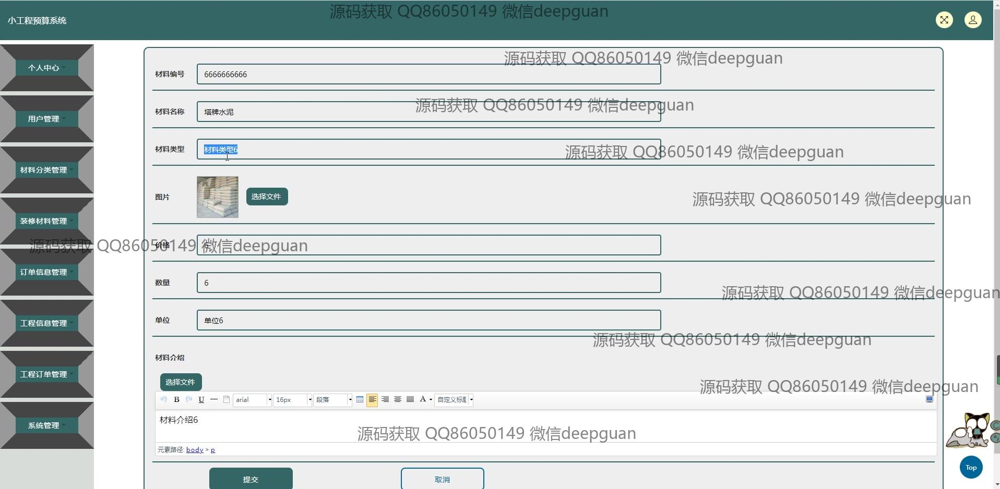

<h1 align="center">小工程预算+jsp</h1>

## 简介
小工程预算系统：角色分为管理员、用户；功能包括个人中心、用户管理、材料分类管理、装备材料管理、订单信息管理、工程信息管理、工程订单管理、系统管理，各模块支持信息录入、编辑、查询、上传和管理操作。    --计算机毕业设计源码；毕设源码；java毕业设计源码

## 联系方式

<h3 align="center">获取完整代码与数据库文件 + 微信：deepguan QQ: 86050149 QQ群: 783742310</h3>

<h3 align="center">可帮忙远程部署 包运行成功！提供远程部署、修改代码、设计文档指导、代码讲解等服务！</h3>

## 功能介绍（完整见运行截图）
管理员：主要功能包括登录、注册和退出操作。在用户管理中，可以编辑和修改用户的密码，并对用户信息进行增删改查。材料分类管理中，管理员可以通过输入框添加和删除材料分类并进行批量操作，确保材料分类的准确性和便捷管理。在工程订单管理中，管理员能查看、审核和删除订单信息；此外，订单信息管理提供批量删除操作，提升管理效率。系统管理模块则包括全局设置以及对用户权限的安排和系统日志的查看。

用户：包含基本操作如登录、注册和退出。用户可以访问个人中心，在个人信息界面更新用户ID、密码、姓名、性别、邮箱和手机号，修改后通过提交按钮保存信息。用户同样可以管理自己的上传头像，通过个人中心界面便捷访问和修改信息。在材料信息管理中，用户能输入材料编号、名称、类型、价格、数量和单位信息，并上传相关图片，以便进行材料的查询和预算编制。订单信息管理则允许用户提交工程名称、面积、报价等信息和进行订单查询。

## 运行截图

本代码来源于网络,仅供学习参考使用!

